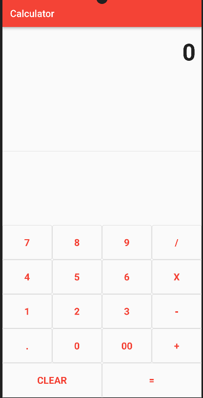

# Flutter Calculator



This is a simple calculator app built with Flutter that allows users to perform basic arithmetic operations such as addition, subtraction, multiplication, and division.

## Features

- Addition (+)
- Subtraction (-)
- Multiplication (X)
- Division (/)
- Decimal Point (.)
- Clear (CLEAR)
- Equals (=)

## Getting Started

Follow these instructions to get the project up and running on your local machine.

### Prerequisites

Make sure you have Flutter and Dart installed. If not, you can download and install them from the [Flutter website](https://flutter.dev/docs/get-started/install).

### Installation

1. Clone the repository:

   ```sh
   git clone https://github.com/yourusername/flutter-calculator.git


